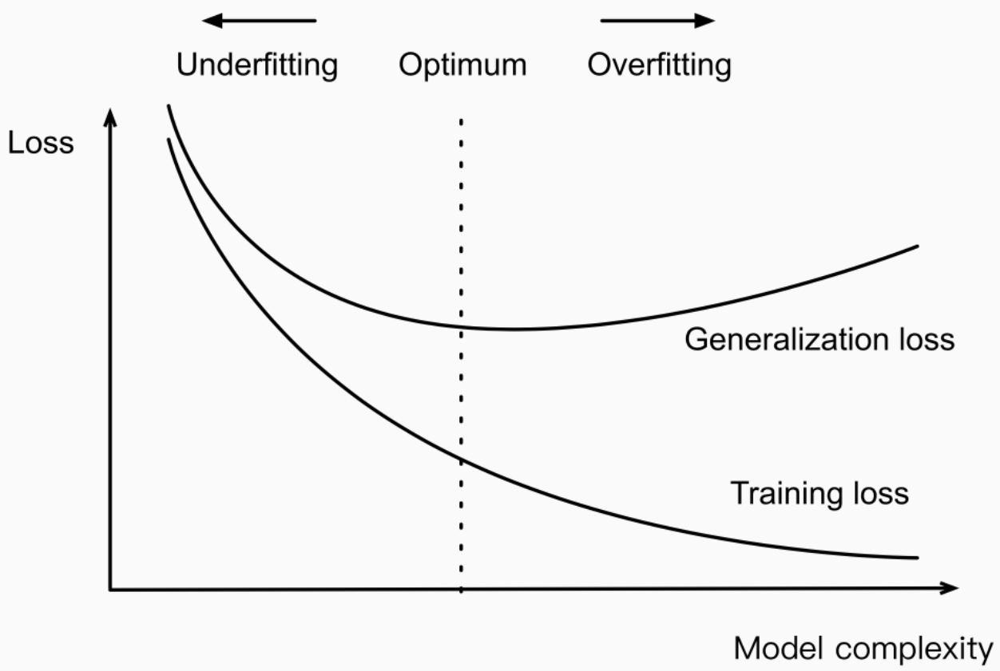

# Función de Pérdida (Loss Function) 💔

La **función de pérdida** mide la discrepancia entre la predicción del modelo y el valor verdadero. Es una métrica de "lo mal" que le va a nuestro modelo.

---

# Función de Pérdida (Loss Function) 💔

Su principal objetivo es encontrar el conjunto de parámetros del modelo que minimizan la función de pérdida.

- Ejemplos comunes incluyen: 
  - Error cuadrático medio (para regresión)
  - Cross entropy loss (para clasificación)

---

# Criterio de Optimización (Optimization Criteria) 🎯

El **criterio de optimización** mide la efectividad general del modelo en todo el conjunto de datos. 

- Por lo general, se basa en la función de pérdida y busca minimizar el error en todas las instancias del conjunto de datos.

---

# Criterio de Optimización (Optimization Criteria) 🎯

Por ejemplo, una **función de coste** podría ser el promedio del valor de la función de pérdida sobre todas las instancias. 

---

# Rutina de Optimización (Optimization Routine) ⚙️

Es el proceso por el cual se va a manejar la información para encontrar una solución al criterio de optimización. 

- Métodos comunes incluyen el **descenso del gradiente** y variantes del mismo.

---

# Rutina de Optimización (Optimization Routine) ⚙️

La rutina de optimización se encarga de actualizar los parámetros del modelo con el fin de minimizar la función de coste.

---
# Resultado del Aprendizaje Automático 🤖
-El resultado de aplicar el algoritmo de aprendizaje sobre un conjunto de datos es un modelo, este modelo nos permitirá realizar predicciones sobre los nuevos elementos no asociados a una información de salida.

---
# Resultado del Aprendizaje Automático 🤖

---

---

# Overfitting y Underfitting 🎭

Cuando entrenamos modelos de machine learning, es común encontrar problemas de overfitting o underfitting. Ambos problemas se relacionan con cómo de bien nuestro modelo se ajusta a los datos de entrenamiento y cómo de bien generaliza a datos no vistos.

---

# Overfitting 📚

El **overfitting** ocurre cuando el modelo se ajusta demasiado bien a los datos de entrenamiento, hasta el punto de aprender el ruido presente en estos datos. Como resultado, el modelo tendrá problemas para generalizar a datos no vistos.

- Señal vs Ruido
  - Señal: Función o patrón "verdadero" que intentamos extraer de los datos.
  - Ruido: Errores de medición, aleatoriedad en los datos, valores atípicos (outliers).

---

---
# Underfitting 📉

El **underfitting** es el problema contrario al overfitting. Se produce cuando nuestro modelo no es lo suficientemente complejo para captar la relación entre los datos de entrada X y los datos de salida Y.

- En este caso, el modelo tiene un mal rendimiento tanto en el conjunto de entrenamiento como en el conjunto de prueba.

---

# Detectando Overfitting y Underfitting 🔎
- Detectar si un modelo tiene overfitting o underfitting comparando su desempeño en el set de entrenamiento y el set de prueba:

- Si el rendimiento en el set de entrenamiento es significativamente mejor que en el set de prueba, probablemente estemos ante un caso de overfitting.
- Si el rendimiento es bajo tanto en el set de entrenamiento como en el set de prueba, probablemente estemos ante un caso de underfitting.

---

# ¿Cómo combatir el Overfitting? 🥊

Aquí hay algunas estrategias para prevenir el overfitting:

- Recolectar más datos.
- Remover características irrelevantes.
- Utilizar técnicas de regularización que hacen al modelo más simple.
- Utilizar early stopping (aunque esta técnica se usa con precaución).
- Ajustar los parámetros del modelo utilizando un set de validación.
